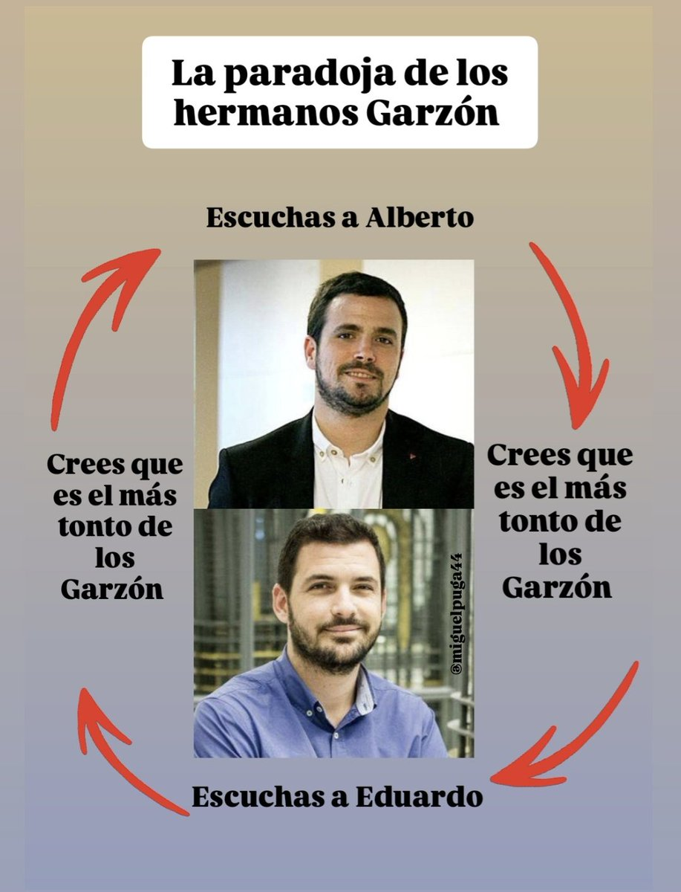

CPython With Built-in Garzon Paradox Solver
=========



This Python implementation solves the Garzon paradox in bytecode generation time


Sample snippet
```
>>> for _ in range(10):
...   print(garzon_mas_tonto)
... 
Alberto
Eduardo
Alberto
Eduardo
Alberto
Eduardo
Alberto
Eduardo
Alberto
Eduardo
```
